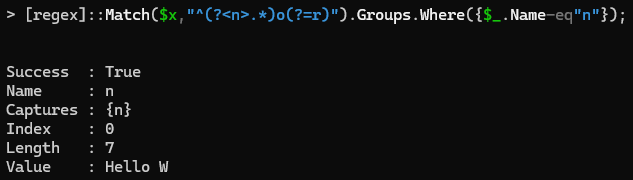

🛠️ - _I'm in the process of retooling this project site. I'm committing the most time here_ [➡️ portfolio/FileCatalog](./portfolio/FileCatalog/README.md).

# About Mark 👋

---

## Background

|||
|:--|:--|
|1999|Graduated Midwestern State University with a Bachelor of Science in Biology.|
|Betweeners|Gained experience in Inventory Control with warehousing jobs.|
|2003-2006|Research and Development Chemist in the Automotive Industry.|
|2006|Joined the **Department of Veterans Affairs** through the VA Technical Career Field (TCF) Internship program.|
|2009|Graduated TCF and worked on the VISN 17 data warehouse and the Region 2 SharePoint.|
|2012|Transitioned as an **Enterprise Data Architect** to the **Business Intelligence Service Line** to serve on the VA's Corporate Data Warehouse (CDW) Architect Team.|
|2015|Redesigned and released the CDW Metadata Report Suite. Undertook an additional role to provide national CDW project/ workgroup support.|
|2016-2021|Developed an inventory paradigm that serves several cataloging and auditing programs. Programs included service account management and customer SQL database view audits.|
|2021|Helped start the CDW Customer Engagement team—the offshoot of the project support role.|
|2022|Joined the **VHA Business Information Office Revenue Operations** to provide technical and data warehousing experience.|

## Examples of stuff you'll find here

|Item|Function|Description|
|:--|:--|:--|
|Documentation|[File Catalog](./portfolio/FileCatalog/README.md)|A programme [^1].|
|Objects|[DOEx.vw_FileDetails (Transact-SQL)](./portfolio/FileCatalog/pages/doex-vw_filedetails-transact-sql.md)|Indexed TSQL View that is Full Text enabled for fuzzy lookups.|
|Extensions|[Database.ExecuteWithResults](./portfolio/common/pages/powerquery/extension/database/database.executewithresults.md)|Extends the **Power Query (_m_)** Sql.Database and Value.NativeQuery functions for **Microsoft Power BI** optimization.|

## PowerShell champion

The bottom line is that PowerShell modules are easily distributed and file copied, especially in a Microsoft Windows server environment. Modules are an efficient alternative to software packagers and installers. PowerShell became platform independent with the release PowerShell Core. We commonly call this _PowerShell 7.x_.

PowerShell is learned quickly through similarities with other languages like Python. As it leans heavily on .NET, it brings C# into clearer focus for the learner. PowerShell executes from SQL Server jobs either from **SQL Server Integration Services (SSIS)** packages or as standalone code—providing an introduction TSQL programmers while extending data **ETL** capabilities. Also, PowerShell interprets or parses other languages—especially markup languages like **JSON** and **XML**. PowerShell users typically begin with basic functional programming (_cmdlets_) to build their familiarity. I began by running _Get_-type cmdlets against **Active Directory**. Soon, I was building custom classes and functions as attention shifted my way.

A truer measure of PowerShell's usefulness comes with its regex support. The following example uses the [.NET Regex class](https://learn.microsoft.com/en-us/dotnet/api/system.text.regularexpressions.regex?view=net-9.0) to return an object that contains the capture group _n_, which contains all the text found between the start of _x_ up to the first character _o_ if and only if _o_ is followed by the character _r_. Each object property, like `Success` or `Value`, is referable to other program components.

<table>
<tr><td style="font-size:9;color:#FFFFFF;background:#4682B4;border:1px solid #808080;">PowerShell</td></tr>
<tr><td style="border:1px solid #808080;background: #f5f5f5;">

</td></tr>
</table>

> I've used this approach to navigate variabilities found in large collections of HTML pages and to mine complex text for key terms.

## What am I currently doing?

* Studying Python with [Complete Python Mastery](https://codewithmosh.com/p/python-programming-course-beginners) from [Code with Mosh](https://codewithmosh.com/).
    * With VA's adoption of Azure Cloud (and Power BI and its visualizations to some extent), I see the need to transfer from a PowerShell programmer into Python.

## Interests

- Data design (i.e., modeling) and wrangling.
- Metadata cataloging and vocabulary mapping.
- Trail running, soccer, and reading.

## Whaz-its

- 💬 Ask me about my experiences with GitHub, XSD and XSLT, T-SQL, and trail races.
- 🌱 I use Kanban and Kaizen (DMAIC) often, but it's muscle memory.
- ⚡ I worked in the _Decaying Flesh Lab_ and as a bouncer during college—neither job being as fun as it sounds.

## References

[^1]: _programme_. This spelling is intentional and reflects the combination of program elements that are designed and engineered to meet objectives and goals.
