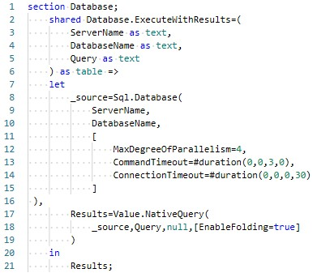
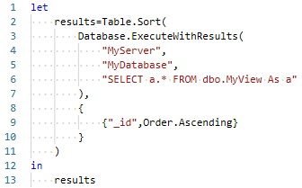
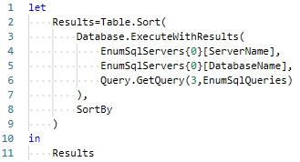

# Database.ExecuteWithResults Function

## Definition

Extends the Power Query function, [`Sql.Database`](https://learn.microsoft.com/en-us/powerquery-m/sql-database) with three options and enforcing query folding by passing the SQL query results through [`Value.NativeQuery`](https://learn.microsoft.com/en-us/powerquery-m/value-nativequery).

## Source code

<table>
<tr><td style="font-size:9;background:#4682B4;border:1px solid #808080;">Power Query</td></tr>
<tr><td style="border:1px solid #808080;background: #f5f5f5;">

</td></tr>
</table>

## Examples

### Example 1: Execute SQL query with discrete parameter values

<table>
<tr><td style="font-size:9;background:#4682B4;border:1px solid #808080;">Power Query</td></tr>
<tr><td style="border:1px solid #808080;background: #f5f5f5;">

</td></tr>
</table>

### Example 2: 

This example will return the same results as the previous when the elements of the first instance of `EnumSqlServers` and the `EnumSqlQueries` query identified with `1` match.

<table>
<tr><td style="font-size:9;background:#4682B4;border:1px solid #808080;">Power Query</td></tr>
<tr><td style="border:1px solid #808080;background: #f5f5f5;">

</td></tr>
</table>

## Remarks

### Enforcing best practices

Power Query developers can enforce database query best practices across a Power BI model through moderation of the query options.

### Replace hardcoded values with variables

Using variables in place of parameter string values codifies the function and allows for more time spend on the queries themselves and for rapid turnaround in Power Query table builds (i.e., copy and paste with index modifications).

## See also

- [EnumSqlQueries] :construction: _info page under construction_.
- [EnumSqlServer] :construction: _info page under construction_.
- [Query.GetQuery] :construction: _info page under construction_.
- [Sql.Database](https://learn.microsoft.com/en-us/powerquery-m/sql-database)
- [Value.NativeQuery](https://learn.microsoft.com/en-us/powerquery-m/value-nativequery)
