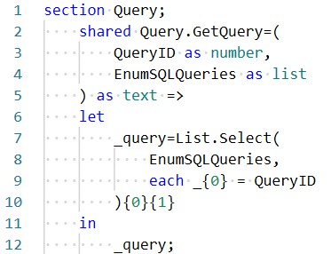
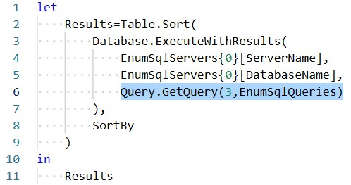
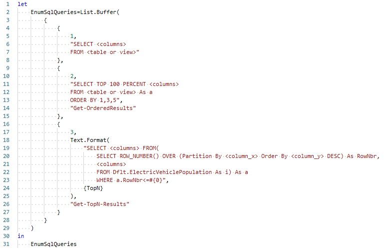

# Query.GetQuery

**Applies to**: ✔️ Power Query M

## About

Returns the query identified by an integer value for queries stored in a variable.

## Source code

<table>
<tr><td style="font-size:9;color:#FFFFFF;background:#4682B4;border:1px solid #808080;">Power Query</td></tr>
<tr><td style="border:1px solid #808080;background: #f5f5f5;">

</td></tr>
</table>

## Examples

### Example 1: Return a data set using the 3 query in the EnumSqlQueries variable.

This example uses the [Database.ExecuteWithResult](../database/database.executewithresults.md) extension to return a query identified with `QueryID=3` in the `EnumSqlQueries` variable.

> The _EnumSqlQueries_ variable shares the same name with the parameter in the `Query.GetQuery` function.

<table>
<tr><td style="font-size:9;color:#FFFFFF;background:#4682B4;border:1px solid #808080;">Power Query</td></tr>
<tr><td style="border:1px solid #808080;background: #f5f5f5;">

</td></tr>
</table>

## Remarks

### EnumSQLQueries variable

The number of members within an instance of `EnumSQLQueries` may differ; however, the it is crucial that the first member of each set be an integer value (e.g., `1`).

#### Set members  
1) QueryID as `integer`
2) Script as `text`
3) QueryName as `text` [_optional_]

<table>
<tr><td style="font-size:9;color:#FFFFFF;background:#4682B4;border:1px solid #808080;">Power Query</td></tr>
<tr><td style="border:1px solid #808080;background: #f5f5f5;">

</td></tr>
</table>

:bulb: The third query above (`QueryID=3`) uses [Text.Format](https://learn.microsoft.com/en-us/powerquery-m/text-format) to pass an integer value from the simple variable `TopN` (_definition not shown_). Realistically, there is little call for this treatment; but it does show how a query can be modified using other variables.

### Errors and debugging

There are no inherent error handling steps in `Query.GetQuery`. Therefore, performance needs to be tested before a model is deployed to production.

## See also

* [Database.ExecuteWithResults](../database/database.executewithresults.md)
* [List.Buffer](https://learn.microsoft.com/en-us/powerquery-m/list-buffer)
* [List.Select](https://learn.microsoft.com/en-us/powerquery-m/list-select)
* [Text.Format](https://learn.microsoft.com/en-us/powerquery-m/text-format)
